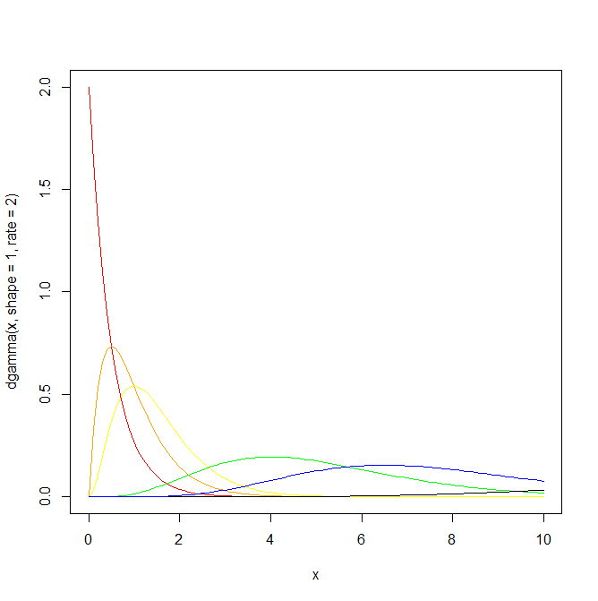
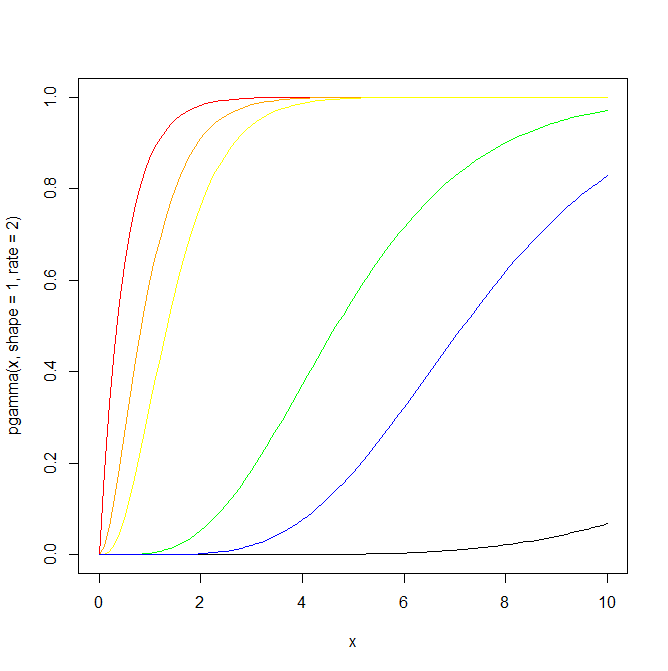
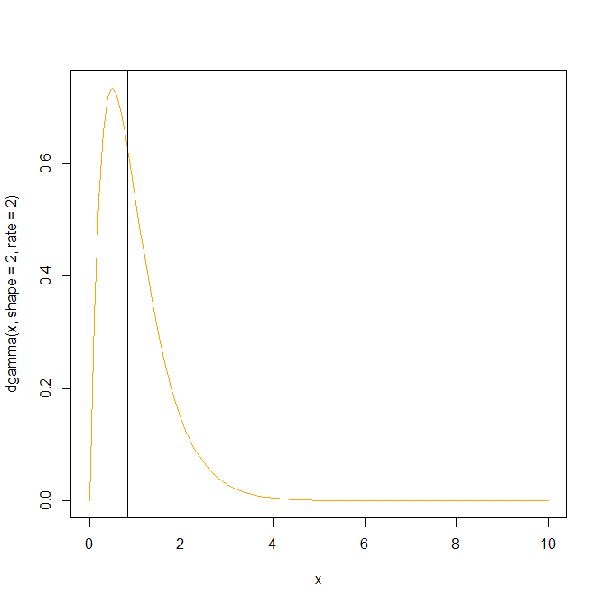

# Gamma rozdelenie

Generický text o rozdelení si môžete prečítať na [Wikipédii](https://en.wikipedia.org/wiki/Gamma_distribution). Zatiaľ stačí vedieť, že rozdelenie má dva parametre a dva rôzne spôsoby parametrizácie. My budeme pracovať s parametrami *shape* a *rate* (druhá možnosť je použiť *shape* a *scale*). 

## Hustota a distribučná funkcia

Najprv si nakreslíme hustotu. Predpokladajme hustoty s týmito parametrami:
```
x = seq(0,10, by=0.1)
plot(x,dgamma(x,shape=1,rate=2),type="l",col="red")
lines(x,dgamma(x,shape=2,rate=2),col="orange")
lines(x,dgamma(x,shape=3,rate=2),col="yellow")
lines(x,dgamma(x,shape=5,rate=1),col="green")
lines(x,dgamma(x,shape=9,rate=0.5),col="black")
lines(x,dgamma(x,shape=7.5,rate=1),col="blue")
```
Dostávame tento obrázok:



Nasleduje distribučná funkcia pre tieto rozdelenia:
```
plot(x,pgamma(x,shape=1,rate=2),type="l",col="red")
lines(x,pgamma(x,shape=2,rate=2),col="orange")
lines(x,pgamma(x,shape=3,rate=2),col="yellow")
lines(x,pgamma(x,shape=5,rate=1),col="green")
lines(x,pgamma(x,shape=9,rate=0.5),col="black")
lines(x,pgamma(x,shape=7.5,rate=1),col="blue")
```

A tu je graf:



## Použitie rozdelenia

Gamma rozdelenie sa dá využiť pri modelovaní množstva zrážok, veľkosti poistných udalostí, veku vzniku rakoviny a podobne. Ďalšie využitia nájdete na [Wikipédii](https://en.wikipedia.org/wiki/Gamma_distribution#Occurrence_and_applications).

## Kvantil

Zaujíma nás grafické znázornenie kvantilu 0.5. Zoberme si hustotu a distribučnú funkciu pre rozdelenie s parametrami `shape = 2` a `rate = 2`. Takto to vyzerá pre hustotu:



a takto pre distribučnú funkciu:


Použitý kód je tu:
```
plot(x,dgamma(x,shape=2,rate=2),type="l",col="orange")
abline(v = qgamma(0.5,shape=2,rate=2),col="black")

plot(x,pgamma(x,shape=2,rate=2),type="l",col="orange")
abline(v = qgamma(0.5,shape=2,rate=2),col="black")
```
