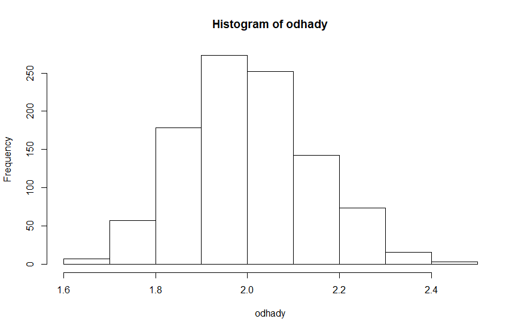
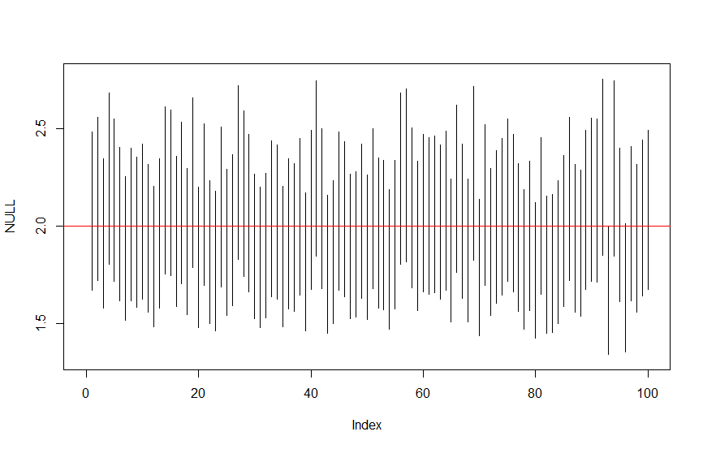

Budeme pracovať s gamma rozdelením (parametrizácia pomocou `shape` a `scale`), pričom zafixujeme hodnotu parametra `scale = 2`. Odhad spočítame iba pomocou momentovej metódy (pomocou maximálnej vierohodnosti to je relatívne náročné).

## Odvodenie hodnoty parametra pomocou momentovej metódy


## Počítanie odhadu

```r
# Nastavenie seed-u, aby sa simulácia dala zopakovať
set.seed(21)

# Výpočet odhadu
x = rgamma(100, shape = 2, scale = 2)
x_mean = mean(x)
odhad = x_mean / 2
odhad

# Výsledok
[1] 2.00402
```

Vidíme, že hodnota odhadu je relatívne blízko pôvodnej hodnote `shape = 2`. Pozrime sa na to čo sa stane, keď si muláciu zopakujeme 1000-krát.

```r
odhady = c(rep(2,1000))

# Funkcia, ktorá nám vygeneruje gamma rozledelenie a spočíta odhad priemeru
generate_gamma_mean = function(sh = 2, sc = 2) {
  y = rgamma(100, shape = sh, scale = sc)
  odhad_y_mean = mean(y) / 2
}

# Opakovanie simulácie
odhady = sapply(odhady, generate_gamma_mean)

# Priemerná hodnota odhadu
mean(odhady)

[1] 2.002122
```

Histogram pre priemery vyzerá takto:



## Konfidenčné intervaly

Konfidenčné intervaly spočítame a zobrazíme pomocou tohto kódu:

```r
# Výpočet
ci_lower=odhady-qnorm(0.975)*odhady/sqrt(100)
ci_upper=odhady+qnorm(0.975)*odhady/sqrt(100)

# Kreslenie grafu
plot(NULL,ylim=c(min(odhady)-0.3,max(odhady)+0.3),xlim=c(0,100))
for(i in 1:100) {
  lines(x=c(i,i),y=c(ci_lower[i],ci_upper[i]))
}
abline(h = 2, col = "red")
```


