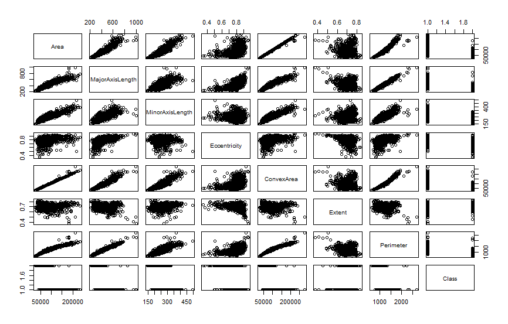
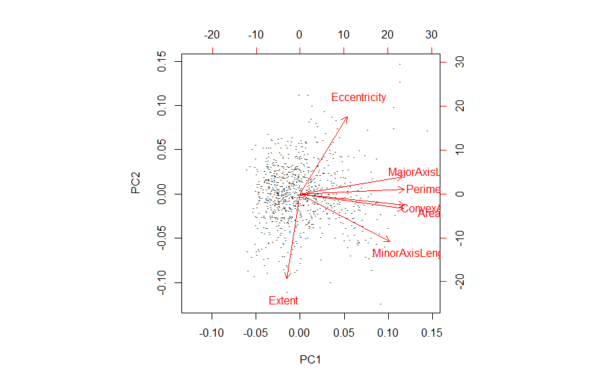
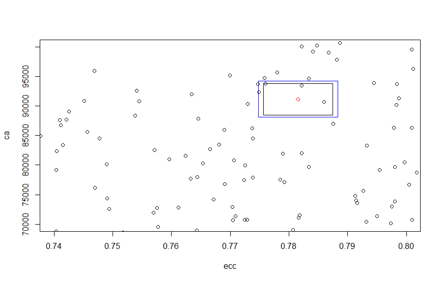

## Základné informácie o použitom datasete

Použil som Raisin dataset z [tejto](https://www.muratkoklu.com/datasets/) stránky. Je potrebné zmeniť desatinné čiarky na bodky a potom to naloadovať do Rka.

Dáta obsahujú údaje o 900 sušených hrozienkach dvoch druhov. Jednotlivé atribúty sú *Area*, *MajorAxisLength*, *MinorAxisLength*, *Eccentricity*, *ConvexArea*, *Extent* a *Perimeter* (predstavte si hrozienko, je celkom jasné čo znamenajú). Keď si dáta vykreslíme pomocou príkazu `plot(raisin_data[,1:7])` dostávame takéto grafy (po dvoch atribútoch):




## PCA

PCA budeme robiť na škálovaných dátach, kedže niektoré hodnoty sú udávané v centimetroch, niektoré v milimetroch štvrocových a podobne. Ako výsledok dostávame:

```
Importance of components:
                          PC1    PC2     PC3     PC4     PC5     PC6     PC7
Standard deviation     2.1982 1.2055 0.79275 0.23838 0.14768 0.08019 0.03179
Proportion of Variance 0.6903 0.2076 0.08978 0.00812 0.00312 0.00092 0.00014
Cumulative Proportion  0.6903 0.8979 0.98770 0.99582 0.99894 0.99986 1.00000
```

Vidíme, že za 98% rozpytu v našich dátach zodpovedajú iba prvé tri komponenty. Na obrázku nižšie môžeme vidieť, ktoré to sú.




## Konfidenčné intervaly

Budeme pracovať s atribútmi *Eccentricity* a *ConverArea*. V grafe vidíte iba určitú časť dát, pretože ináč neboli konfidenčné intervaly viditeľné.



Ak sa niekto dočítal až sem, bude odmenený mojim zdrojovým kódom použitým na generovanie grafu s konfidenčnými intervalmi. Podobnosť so vzorovým kódom v zadaní tam **určite** nie je.

```
ecc = d$Eccentricity
ca = d$ConvexArea

plot(ecc, ca, xlim=c(0.74,0.8), ylim=c(70000,100000))
points(mean(ecc), mean(ca), col = "red")

# T-testy
t1 = t.test(ecc)$conf.int
t2 = t.test(ca)$conf.int

lines(x=c(t1[1],t1[1],t1[2],t1[2],t1[1]), y=c(t2[1],t2[2],t2[2],t2[1],t2[1]))

# Elipsa
S=var(cbind(ecc,ca))
ev=eigen(S)
S12=ev$vectors%*%diag(1/sqrt(ev$values))%*%t(ev$vectors)
n=nrow(d)

m1=mean(ecc)
m2=mean(ca)
mriz=seq(-0.5,1.5,by=0.005)
contour(mriz,mriz,outer(mriz,mriz,function(x,y){n*apply((cbind(x-m1,y-m2)%*%S12)^2,1,sum)<=qchisq(0.95,2)}),add=TRUE,col="green",drawlabels=FALSE)

# Bonferroni
t1b=t.test(ecc,conf.level=0.975)$conf.int
t2b=t.test(ca,conf.level=0.975)$conf.int

lines(x=c(t1b[1],t1b[1],t1b[2],t1b[2],t1b[1]), y=c(t2b[1],t2b[2],t2b[2],t2b[1],t2b[1]),col="blue")
```
