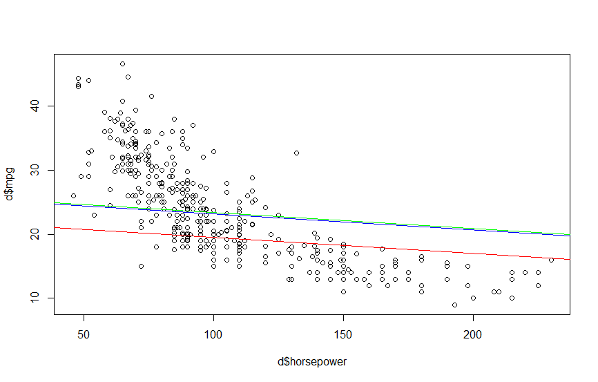
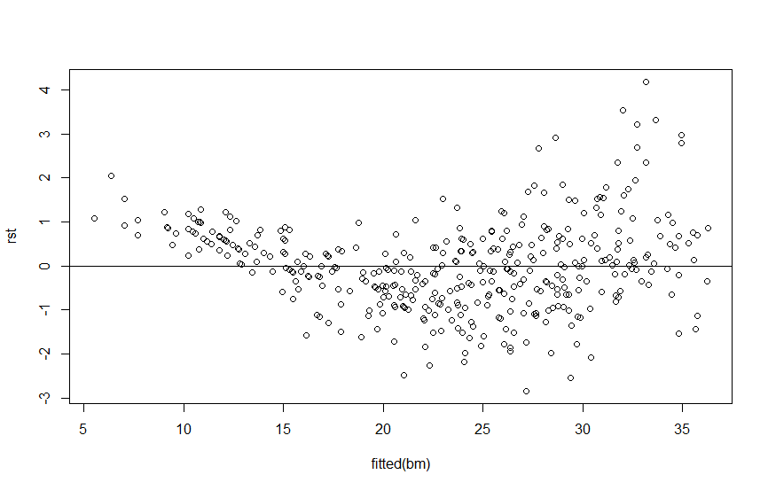
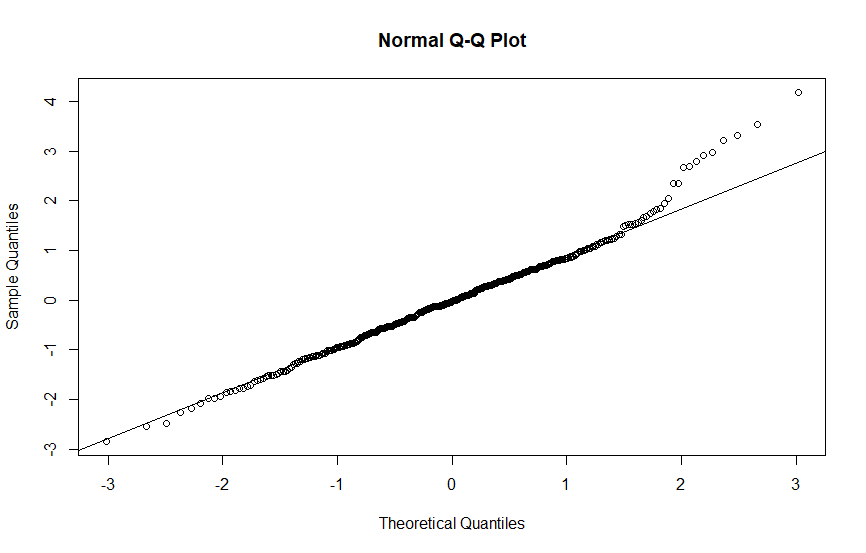

## Dáta

Budeme používať dataset Auto z knižnice ISLR. Podrobnosti o tomto datasete sa dočítate napríklad [tu](https://rdrr.io/cran/ISLR/man/Auto.html).

## Lineárna regresia

Budeme predikovať parameter *mpg* (miles per gallon). Zároveň pridáme parameter *forigin*, ktorý bude faktorom numerického parametra *origin* (predpokladáme, že ako faktor bude tento parameter významnejší). Začneme s modelom, ktorý bude využívať všetky parametre okrem *name* a pomocou funkcie `stepAIC()` následne získame optimálny model. Dostávame:

```R
d = Auto
d$forigin = factor(d$origin, levels=1:3, labels=c("American", "European", "Japanese"))
BiggestReg = lm(mpg ~ . - name, data = d)
stepAIC(BiggestReg, direction = "both")

# Best model
Call:
lm(formula = mpg ~ cylinders + displacement + horsepower + weight + 
    year + forigin, data = d)

Coefficients:
    (Intercept)        cylinders     displacement       horsepower           weight             year  foriginEuropean  
      -16.33231         -0.50277          0.02337         -0.02500         -0.00646          0.77388          2.63452  
foriginJapanese  
        2.85736
```

Optimálny model teda nevyužíva parameter *acceleration* a používa faktorový typ parametra *origin*. Grafické znázornenie pre atribút horsepower vyzerá takto:



## Významnosť odhadnutých koeficientov

Pozrime sa na to čo nám hovorí model:
```
summary(bm)

Coefficients:
                  Estimate Std. Error t value Pr(>|t|)    
(Intercept)     -1.633e+01  4.219e+00  -3.871 0.000127 ***
horsepower      -2.500e-02  1.078e-02  -2.320 0.020855 *  
cylinders       -5.028e-01  3.207e-01  -1.568 0.117742    
displacement     2.337e-02  7.613e-03   3.070 0.002292 ** 
weight          -6.460e-03  5.763e-04 -11.209  < 2e-16 ***
year             7.739e-01  5.161e-02  14.994  < 2e-16 ***
foriginEuropean  2.635e+00  5.661e-01   4.654 4.50e-06 ***
foriginJapanese  2.857e+00  5.525e-01   5.172 3.74e-07 ***
---
Signif. codes:  0 ‘***’ 0.001 ‘**’ 0.01 ‘*’ 0.05 ‘.’ 0.1 ‘ ’ 1

Residual standard error: 3.305 on 384 degrees of freedom
Multiple R-squared:  0.8239,	Adjusted R-squared:  0.8207 
F-statistic: 256.7 on 7 and 384 DF,  p-value: < 2.2e-16

```

Vidíme, že všetky koeficienty sú štatisticky významné až na koeficient počtu cylindrov. Čo sa týka nulovosti koeficientov, túto hypotézu otestujeme pomocou anovy:

```
anova(bm)
Analysis of Variance Table

Response: mpg
              Df  Sum Sq Mean Sq  F value    Pr(>F)    
horsepower     1 14433.1 14433.1 1321.331 < 2.2e-16 ***
cylinders      1  1213.4  1213.4  111.088 < 2.2e-16 ***
displacement   1   233.3   233.3   21.361 5.202e-06 ***
weight         1   975.7   975.7   89.326 < 2.2e-16 ***
year           1  2411.8  2411.8  220.802 < 2.2e-16 ***
forigin        2   357.1   178.6   16.346 1.538e-07 ***
```

Keďže P-value je pri všetkých koeficientoch dostatočne malá, nulová hypotéza neplatí pre žiaden z koeficientov.

## Splnenie predpokladov modelu

Vytvorme si graf reziduí a Q-Q plot:





S homoskedasticitou to nevyzerá veľmi nádejne, preto ešte otestujeme našu nulovú hypotézu (homoskedasticitu):

```R
studentized Breusch-Pagan test

data:  bm
BP = 31.146, df = 7, p-value = 5.844e-05
```

Predpoklad homoskedasticity je teda porušený. Čo sa týka normality reziduí, tam to až na ten koniec vyzerá pomerne v poriadku.
